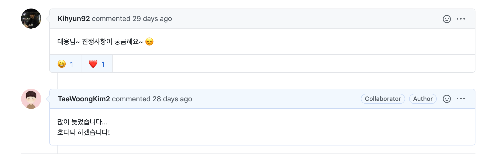
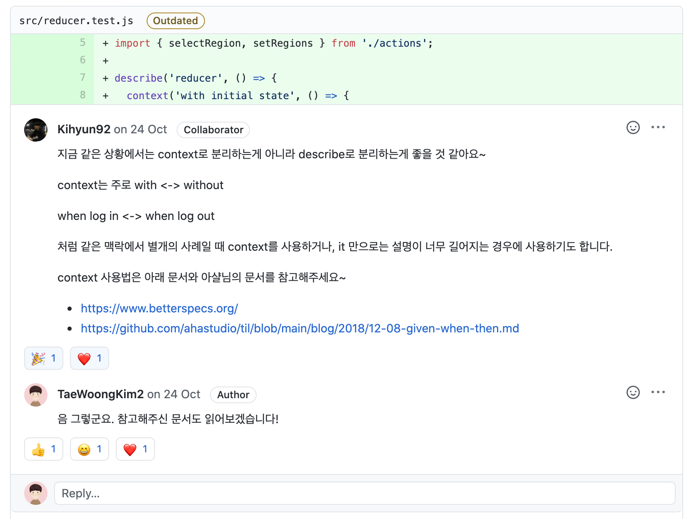

# 코드숨(CodeSoom)

## 코드숨 강의를 선택한 이유는? 
코드숨을 선택한 이유는 간단하다. 코드숨은 그 어디에도 존재하지 않을 것 같았던 나의 모든 니즈를 충족시킬 만한 강의라고 생각했기 때문이다. 강의를 듣기 전 내 니즈는 다음과 같았다.

1. 평소 관심있던 리액트에 대해 전반적인 개념과 기본기부터 응용까지 확실히 잡아줄 강의가 필요했다. 

2. 프론트엔드에서의 TDD스러운 개발은 무엇인지 TDD는 어떻게 이루어지는지에 대한 궁금증을 해소해주고 직접 경험해 볼 수 있는 기회가 필요했다. 

3. 온라인 강의지만 나에게 강제성을 줄 수 있는 강의가 필요했다. 
적지 않은 강의 기간동안 나에게 매서운 채찍질을 날려줄 수 있는 멘토가 있는 교육 과정을 원했다.

 
정말 신기하게도 코드숨은 이를 모두 만족시켜줄 것 같은 기대를 갖게 했고, 강의 기간 내내 이를 모두 충족시켜준 어디에도 이런 강의가 없을만큼 만족도가 정말 높은 강의였다.
 
 

그리고, 유투브에서 코딩의 신 아샬이라는 채널을 본 적이 있었는데 '어? 그분이 강의를 진행하시네!!!' 하면서 뭔가 운명같은 느낌이 들기도 했고,
평소 유투브 봤을 때부터 아샬님의 개발 마인드는 저 세상 마인드구나 라고 생각했기 때문에 뭔가 신뢰도가 급 상승되는 느낌도 한 몫 했다.

 

---

 

## 코드숨을 통해 얻은 것은?

얻어가는게 정말 많지만 그 중에서도 대표적인 몇 가지를 적어본다.

나에게 가장 좋은 영향으로 다가왔던 것은 코드숨 강의를 같이 듣는 동기들이다. 
엄청 열정적으로 하시는 분도 계시고 정말 좋은 꿀팁들을 마구마구 공유해주시는 멘토님들과 동기분들에게 자극을 엄청 많이 받았다. 
강의를 듣기 전까지 회사 업무만 하는 우물 안의 개구리 였는데, 다른 환경에서 다른 목표로 열심히 정진하는 동기들을 보고 얻어가는게 많았으며, 나도 열심히 해야지 그리고 나도 할 수 있다는 생각을 계속 갖게 했다. 비록 3개월이라는 시간은 지나갔지만, 코드숨 커뮤니티에 동기들과 여러 멘토님들은 그대로 남아있기 때문에 좋은 사람들과의 커뮤니티를 하나 얻었다고 생각된다.

그리고, 코드 리뷰에 대한 경험과 좋은 개발 문화에 대한 필요성을 느끼게된 계기가 되었다. 
강의를 듣기 전까지 코드 리뷰를 받은 경험이 전무하다. 
막상 받아보니 '정말 꼭 필요한 문화구나'라고 생각이 강하게 든다. 
코드 리뷰는 일단 코드의 질을 생각하게끔 만든다. 뭐가 더 효율적이고 가독성이 좋을까? 굳이 주석이 필요없는 코드를 짜기 위해서는 어떻게 해야할까? 등 자연스럽게 스스로에게 다양한 질문과 생각을 하게 만들고 여태까지 내가 개발해왔던 과정에 대해서 많은 반성을 하게 만들었다. 이 부분에 있어서 정말 값진 경험을 하게 된 것 같다.

마지막으로, 개발자로써의 공감대를 얻었다. 
개발을 하면서 나만 모르는게 아닌가? 이렇게 하는게 맞을까? 하는 고민을 항상 갖고 있었다. 
이런 고민들은 은근히 자신감을 떨어트리고 개발에 대한 흥미를 조금씩 조금씩 갉아먹고 있는 듯 했다. 
코드숨에서 과제를 하면서 그리고 커뮤니티에 올라오는 질문과 답변을 통해서 서로 생각을 공유하고 토의하는 과정에서 같은 고민을 하고 있구나 하는 공감대를 형성할 수 있었다. 
다른 분들은 다르게 느꼈을 수 있겠지만, 이런 과정이 재미있게 느껴졌고 개발에 대한 재미도 다시금 생기는 것 같았다.

 

   
   과제마다 제한 조건과 요구 사항들이 존재하기 때문에 오히려 깊게 생각해볼 수 있었음

 

   
   하하... 지금 봐도 반성하게 되넹

 

   
   항상 코드리뷰 후 참고 자료를 주셔서 매번 감사하고 만족도 UP

 

강의 커리큘럼 별 내용은 핵심적인 부분들에 대해 내용이 알찼고, 이후에 듣을 예정이신 모든 분들도 충분히 만족할 수 있을 것 같다.
강의 질에 대해서 크게 걱정하지 않아도 될 것 같다.

 

---

 

## 앞으로의 계획은?

3개월 간의 코드숨 강의는 끝이 났고, 이제부터는 새로운 목표를 향해 나아갈 때이다.
2021년 계획을 글로 적어 내려가면서 다짐해본다.

   ### 제 1 목표 - 건강한 몸 만들기!
   
   직장에서 올바른 자세를 유지하지 못한 죄로 목과 허리에 통증이 생겨버렸다. 
   몸이 건강해야 정신도 맑아지고 스터디도 꾸준히 할 수 있을텐데, 자기관리에 실패했다 ㅠㅠ... 

   

    
    지금은 코로나 때문에 P.T는 당분간 힘들지만, 집에서 유투브를 보면서 홈트를 열심히 따라하고 있다.
    회사 입장에서도 건강한 몸을 갖춘 친구들을 더욱 선호한다고 생각하기 때문에 나의 미래를 위해서라도 건강 관리를 제 1 목표로 선정했다.
      
    살도 좀 빼고 더욱 건강한 몸을 만드는게 목표다!
   

    
   
   ### 제 2 목표 - 다시 되돌아보는 리액트 그리고 새로운 리액트 프로젝트

   코드숨을 통해서 "오늘 뭐 먹지?!"라는 개인 프로젝트를 진행했다.
   사실 처음에 생각했던 것 만큼 높은 완성도를 보여주지 못했다.
   게을렀던 나에게 따끔한 반성을 해야할 부분이다.
   사실 이 프로젝트도 만들 때 정말 재미있게 만들긴 했지만, 실력이 많이 부족했기 때문에 머리 속에 있는 것들을 구현함에 있어서 많이 힘들었다.
   어려웠던 만큼 다시 복습하고 더 많은 시간을 투자해야 한다.

    3개월 간 값지게 배운 만큼 내 몸에 베일 수 있도록 복습하고자 한다!
   
   코드숨을 통해 프로그래밍을 공부하는 방법을 배웠고, TDD를 통해 신뢰도 높은 코딩을 하는 법과 애자일스러운 어플리케이션 개발을 어떻게 해야하는지를 깨닳을 수 있었다.
   이런 것들을 어디서 배울 수 있을까 싶다. 시간을 투자해서 배운만큼 "똥"이 되지 않도록 복습을 통해 완전 내 것으로 만들고자 한다.

   

    
    기본기는 정말 제대로 배웠다고 생각한다. 여기서 나아갈 것은 꾸준한 반복 학습과 응용이라고 생각한다.
    몇 가지 더 만들어 보고 싶은 것들도 있고 클론코딩하고 싶은 것들도 있는데, 생각만 하지 말고 직접 만들어 볼 것이다.
   
    만들고 싶은 어플리케이션이 많다.
    생각은 그만하고 다 만들어보자!
   

    

   ### 제 3 목표 - 이직, 좋은 개발 문화를 곁들인... 

   코드숨을 신청하고 끝까지 완강할 수 있었던 원초적인 목표는 역시 **좋은 개발 문화를 갖고 있는 곳으로의 이직**이다.
   현재 다니고 있는 회사도 물론 좋은 회사이지만, 개발 문화에 있어서는 '글쎄...'라는 생각이 든다.
   
   

    
    아직까지 내가 개발자라는 직업과 잘 어울리는지 적성에 맞는지 100% 확신할 수 없다.
    다만, 개발 이외에 어떤 것도 생각해본 적도 없을뿐더러 개발을 통해 가치를 만들고 그 결과를 남들에게 보여주는 그 순간의 성취감은 너무 매력적이며 나에게 좋을 영향으로 다가온다.
   
    그래서, 좋은 개발 문화가 있는 곳을 경험해보고 싶다!
   

    
   
   개발이라는 일에 더 확신을 갖고 싶고 나 혼자 힘으로만 성장하는 것이 아닌 주변 사람들과 지속적인 커뮤니케이션과 시너지, 공감을 통해 같이 성장하는 환경에서 일해보고 싶다. 이 목표를 위해 2021년에는 더욱 공격적으로 가고 싶은 곳으로 지원할 예정이고, 코드숨 동기들과 지속적인 정보와 소식을 꾸준히 공유할 예정이다.

